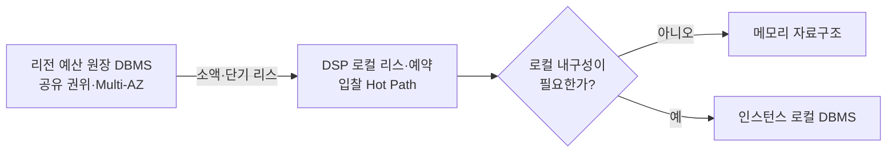

# DSP 기술 결정 경계

상태: 로컬 예산 권한과 리전 원장 PostgreSQL 기준선 확정

근거: [DSP 컴포넌트](../views/dsp-components.md), [데이터 접근·보존 기준](../views/data.md), [분산 캠페인 예산 예약](../decisions/ADR-001-distributed-budget-reservation.md)

## 핵심

로컬 예산 권한과 리전 원장의 기술 기준선을 선택했다.

1. 리전 예산 원장은 PostgreSQL 트랜잭션·행 잠금·고유 제약으로 리스 발급·정산의 단일 권위를 보존한다.
2. DSP 인스턴스는 JVM 힙의 캠페인별 잠금과 리스별 예약 인덱스로 로컬 리스·5초 예약을 처리한다.
3. 인스턴스 장애는 상위 리스 격리로 복구하며 로컬 DBMS를 사용하지 않는다.

두 번째와 세 번째는 같은 검토에서 결정했다. 로컬 내구성 없이 금액이 안전하게 수렴하므로 메모리 기준선을 사용하며, 측정에서 복구 이익이나 자원 한계가 확인될 때만 내장 DBMS·다른 자료구조를 다시 비교한다.



## 1. DSP 데이터별 로컬 구조

모든 로컬 데이터를 캐시라고 부르면 안 된다. 재생성 가능한 투영과 위임받은 금액 권위는 유실·축출의 의미가 다르다.

| 데이터 | 성격 | 일관성·동시성 | 우선 자료구조 | DBMS 역할 |
|---|---|---|---|---|
| 캠페인 실행 자료 | 원본에서 재생성 가능한 불변 스냅숏 | 읽기 다수, 실행 중 변경 없음 | 외부 ID→정수 인덱스, 연속 배열, 규격별 후보 ID 배열, 완성본 원자 교체 | 시작 전 원본 적재에만 사용 |
| 페이싱 위치 | 리스 사용량에서 만든 결과적 일관성 투영 | 다소 오래된 값을 허용, 입찰은 읽기만 수행 | 캠페인 정수 인덱스와 맞춘 원시형 배열 또는 불변 스냅숏 | 필요 없음 |
| 로컬 리스 권한 | 인스턴스에 위임된 금액 권위 | 캠페인별 조건부 차감, 세대·만료와 잔액을 함께 보호 | 캠페인 계정별 비공정 `ReentrantLock`, 계정 안의 다중 리스 | 매 입찰 경로에는 사용하지 않음 |
| 5초 예약 | 리스 권한의 잠재 지출 상태 | `lurl`·`burl`·만료 중 한 번만 종결, 높은 생성·삭제 빈도 | 리스별 예약 해시 인덱스, 전역 `DelayQueue` 만료 표식 | 과금 사건만 외부에 내구 기록 |
| 입찰 요청 상태 | 같은 요청의 단일 실행을 지키는 짧은 안전 상태 | 동일 키 동시 실행 하나, 결과 5초 재사용 | 요청 키 해시 인덱스, 실행 중 작업·완성 응답, 만료 인덱스 | 외부 조회 없음 |
| 예약 통지 검증 키 | 짧은 읽기 전용 보안 설정 | 키 교체 때 완성본 교체, 요청 중 혼합 금지 | 불변 키 맵과 원자 참조 교체 | 제어 경로 원본에만 사용 |
| 지역 금액 사건 | `lurl`·`burl`의 내구 원본 | 성공 응답 전 append, 사건 ID별 효과 한 번 | 로컬 메모리는 가속 보조만 가능 | PostgreSQL이 원본 |
| 지표 | 유실 가능한 파생 데이터 | 근사 합계 허용, 쓰기 경합 최소화 | 분산 카운터·히스토그램 | 관측 저장소로 비동기 전달 |

### 캠페인 실행 자료

캠페인 외부 식별자는 시작할 때 한 번 정수 인덱스로 바꾼다. 입찰 경로에서는 문자열 해시와 객체 탐색 대신 연속 배열과 슬롯 규격별 후보 ID 배열을 읽는다. 새 스냅숏은 모두 검증·인덱싱한 뒤 하나의 참조를 교체해 부분 적재 상태를 노출하지 않는다.

### 로컬 리스 권한

단순 합계 카운터만으로는 부족하다. `잔액 충분 여부 확인`, `차감`, `예약 등록`이 한 연산이어야 하고, 리스 상태와 기한이 바뀌는 순간의 예약도 함께 차단해야 한다.

```text
CampaignBudgetAccount
  ├─ 비공정 ReentrantLock
  └─ LeaseAccount 여러 개
       ├─ PENDING | OPEN | DRAINING
       ├─ unused + reserved + committed = faceValue
       └─ 해당 리스의 예약 Map
```

같은 캠페인의 복합 변경은 `tryLock()`을 얻은 실행자 하나만 수행한다. 획득에 실패한 입찰은 기다리지 않고 다음 캠페인 후보를 시도한다. 서로 다른 캠페인은 독립 계정이라 병렬 처리된다. 잠금 안에서는 정수 연산과 메모리 인덱스만 변경하며 저장소·네트워크·암호화 호출을 금지한다.

한 캠페인에 여러 `OPEN` 리스를 허용한다. RTB 입찰 대부분이 패찰되면 예약액이 원래 리스로 돌아오므로 이전 리스를 즉시 종료하면 반환 권한이 정산까지 묶이기 때문이다. 새 예약은 금액이 충분한 `OPEN` 리스 중 만료 시각과 세대가 앞선 것을 사용한다. 예약 하나는 정확히 한 리스에 귀속된다.

### 예약과 만료

```text
reservationId
  → RESERVED
      ├─ RELEASED  (lurl)
      ├─ COMMITTED (burl)
      └─ EXPIRED   (5초)
```

종결 상태와 리스 금액은 같은 캠페인 잠금 아래 한 번만 바꾼다. `RELEASED`와 `EXPIRED`는 원래 리스의 미사용액으로 반환하고 `COMMITTED`는 확정 대기액으로 옮긴다. 리스가 `OPEN`이면 반환액을 재사용하고 `DRAINING`이면 정산 전까지 새 예약에 쓰지 않는다.

만료 표식은 `campaignId`, `leaseId`, `reservationId`, 단조 시계 기한을 가진 `DelayQueue`에 둔다. 만료 작업자는 직접 금액을 바꾸지 않고 지역 사건 저장소의 최초 종결 판정을 거쳐 `expire`를 호출한다. 이미 종결된 표식은 꺼낸 뒤 무시한다.

## 2. 리전 예산 원장 DBMS

### 압박

- 같은 캠페인의 동시 리스 발급 합계가 리전 책임액을 넘으면 안 된다.
- `leaseId`·세대별 발급과 정산은 중복 호출에도 한 번만 반영돼야 한다.
- 인기 캠페인에 쓰기가 몰려도 다른 캠페인을 함께 막지 않아야 한다.
- 인스턴스·AZ 장애 뒤에도 리전 내부 쓰기 권위와 확정 결과를 복구해야 한다.
- 매 입찰이 아니라 리스 발급·보충·정산만 접근하므로 50ms 경매 Hot Path의 DBMS가 아니다.

### 선택과 대안

| 후보 | 강점 | 감수할 점 | 확인할 핵심 |
|---|---|---|---|
| 트랜잭션 RDBMS | 조건부 갱신·고유 제약·트랜잭션으로 불변식을 직접 표현하기 쉽다. | 인기 캠페인의 행 경합과 수평 확장 한계를 검증해야 한다. | 캠페인 분할, 잠금 대기, 장애 전환 뒤 쓰기 권위 |
| 내구형 인메모리 DBMS | 리전 내부 리스 발급 지연과 높은 쓰기 처리량에 유리하다. | 복제·장애 전환 중 승인된 쓰기의 보존 의미를 별도로 증명해야 한다. | 원자 스크립트, 영속화, 정족수와 장애 시 쓰기 정책 |
| 분산 SQL·NewSQL | 샤딩·복제·합의를 제품 경계에서 제공할 수 있다. | 합의 지연, 운영 복잡도와 작은 프로젝트에서의 과도한 범위를 감수한다. | 캠페인 키 분할, 리전 내부 정족수, 부분 장애 지연 |
| 직접 구현한 합의 원장 | 요구에 맞춘 제어가 가능하다. | DBMS 자체를 만드는 일이 되어 프로젝트 핵심 범위를 벗어난다. | 후보에서 제외 |

PostgreSQL을 선택했다. 리스 쓰기 부하와 인기 캠페인 경합이 실제 한계를 만들 때 DynamoDB와 분산 SQL을 같은 시험으로 비교한다. 결정 근거는 [ADR-010](../decisions/ADR-010-regional-budget-ledger-store.md)에 둔다.

## 3. DSP 로컬 리스 토큰 자료구조

### 상태

로컬 상태는 전역 예약 인덱스 없이 캠페인과 리스 경계로 찾는다.

```text
campaignId → CampaignBudgetAccount
CampaignBudgetAccount → leaseId → LeaseAccount
LeaseAccount → reservationId → Reservation
```

검증된 통지와 만료 표식이 세 식별자를 모두 전달하므로 전역 `reservationId` Map을 중복 유지하지 않는다.

```text
DelayQueue → campaignId + leaseId + reservationId
```

### 압박

- 입찰마다 외부 호출 없이 조건부 차감을 한 번 수행해야 한다.
- `예약 + 사용 가능액 + 확정 대기액 + 격리액 = 리스 액면`을 항상 지켜야 한다.
- 상위 1% 캠페인에 금액 연산 20%가 집중되는 편향을 견뎌야 한다.
- `lurl`, `burl`, 만료가 동시에 와도 예약은 한 번만 종결돼야 한다.
- 5초 예약을 전체 순회하지 않고 만료해야 한다.
- 총 10만 캠페인·활성 3만 캠페인과 처리 중 예약의 메모리·GC 상한을 설명할 수 있어야 한다.

### 후보

| 후보 | 강점 | 감수할 점 |
|---|---|---|
| 캠페인별 `ReentrantLock.tryLock()` | 금액과 예약의 복합 전이를 한 경계에서 표현하고 경합 시 즉시 다음 후보로 갈 수 있다. | 같은 캠페인 변경은 직렬화되며 잠금 안의 작업을 짧게 제한해야 한다. |
| 캠페인별 CAS | 단일 값은 비차단으로 바꿀 수 있다. | 잔액·리스·예약 Map의 복합 전이를 한 CAS로 표현하기 어렵고 재시도 할당이 생긴다. |
| 샤드별 단일 작성자 + 원시형 인덱스 | 같은 샤드의 상태 전이를 직렬화해 불변식과 메모리 배치를 단순화한다. | 큐 대기와 샤드 편향, 작성자 장애·백프레셔를 설계해야 한다. |
| 오프힙 인덱스 | 객체 수와 GC 영향을 줄일 수 있다. | 직렬화·메모리 수명·디버깅 비용이 생기며 먼저 측정하지 않으면 과도한 최적화다. |

초기 기준선은 `campaignId` 동시 해시 인덱스, 캠페인별 비공정 `ReentrantLock`, 리스별 일반 해시 인덱스와 전역 `DelayQueue`다. 인스턴스 전체 미종결 예약 20,000개, 캠페인별 2,500개를 초기 상한으로 두고 기존 상태를 축출하지 않은 채 신규 예약만 거절한다. 측정에서 잠금 대기가 입찰 p99를 침범할 때만 샤드 단일 작성자나 압축 구조를 비교한다.

## 4. DSP 인스턴스 DBMS 필요성

### 먼저 물을 질문

인스턴스가 죽었을 때 로컬 예약을 즉시 복원해야 하는가?

현재 장애 계약은 다음과 같다.

- 리전 원장은 DSP에 넘긴 리스 액면을 이미 자기 가용액에서 제외한다.
- DSP 인스턴스가 사라지면 해당 리스를 즉시 다른 인스턴스에 주지 않는다.
- 사용 여부가 불확실한 금액은 통지 기한과 정산이 끝날 때까지 격리한다.
- 로컬 상태를 잃어도 리스 원본과 내구 `burl` 사건으로 제한 시간 뒤 소비·반환액을 재구성해야 한다.

장애 인스턴스의 리스를 다른 인스턴스가 즉시 이어받지는 않는다. 분할 상태의 기존 인스턴스가 아직 권한을 사용할 가능성이 있기 때문이다.

```text
safeRecoveryAt = leaseExpiresAt + 최대 예약 수명 5초

리스 액면
= safeRecoveryAt까지 내구 기록된 유효 burl 합계
+ 반환 가능한 나머지 금액
```

복구기는 리스를 격리하고 `safeRecoveryAt` 뒤 `leaseId`별 유효 `burl`을 합산한다. 같은 `leaseId + settlementGeneration`으로 소비·반환을 한 번 정산한다. 따라서 로컬 예약 객체는 유실될 수 있지만 리스 액면은 유실되면 안 된다.

이 제한 시간 복구 계약이 유지된다면 로컬 DBMS는 예산 정합성의 필수 요소가 아니다. 로컬 DBMS는 같은 인스턴스의 즉시 재시작과 예산 활용률을 개선하는 선택지다.

### 후보

| 후보 | 강점 | 감수할 점 | 현재 판단 |
|---|---|---|---|
| DBMS 없이 프로세스 메모리 사용 | 0-Hop, 가장 낮은 지연과 단순한 장애 경계 | 장애 리스를 `leaseExpiresAt + 5초`까지 격리한 뒤 외부 원본으로 재구성 | 선택 |
| 내장 WAL·키값 DBMS | 같은 인스턴스 재시작 때 예약을 복원할 수 있음 | 입찰마다 로컬 쓰기·동기화·쓰기 증폭이 생기며 인스턴스 소실은 막지 못함 | 복구 이익 측정 후 검토 |
| 로컬 DBMS 사이드카 | 프로세스와 저장 수명을 분리할 수 있음 | 로컬 네트워크 Hop, 별도 장애·배포·복제 경계가 생김 | 현재 제외 |
| 리전 공유 DBMS에 예약 기록 | 인스턴스 변경 뒤에도 상태를 조회 가능 | 매 입찰 원격 쓰기로 0-Hop과 캠페인별 병렬성을 잃음 | 아키텍처와 충돌하여 제외 |

로컬 DBMS 도입 여부는 처리량만으로 결정하지 않는다. 장애 후 복구한 예약이 상위 리스 격리보다 실제로 예산 활용률을 얼마나 개선하는지와, 그 대가로 입찰 p99·쓰기 증폭·운영 복잡도가 얼마나 증가하는지를 함께 측정한다.

## 5. 함께 검증할 인접 압박

세 결정과 직접 맞닿은 다음 항목도 같은 기준선 시험에 포함한다.

| 경계 | 확인할 내용 |
|---|---|
| 캠페인 실행 스냅숏 | 규격별 불변 인덱스, 후보 p99 1,000개 조회, 객체 수와 GC |
| 입찰 요청 상태 | 게이트웨이 소유자 라우팅 뒤 요청 키·지문·완성 응답의 5초 메모리 상한 |
| 예약 통지 증표 | 예약·리스·금액·기한을 담는 최소 이진 표현과 검증 비용 |
| 지역 금액 사건 기록 | PostgreSQL 내구 append와 중복 판정이 통지 적체를 입찰 경로로 전파하지 않는지 |

이 네 항목은 중요하지만 현재 세 결정과 같은 새 DBMS 권위 선택은 아니다. 캠페인·중복·증표는 로컬 표현 선택이고, 지역 금액 사건 기록은 PostgreSQL로 이미 확정됐다.

## 6. 선택 순서와 합격 증거

1. 로컬 DBMS 없이도 인스턴스 장애가 리스 격리·만료·정산으로 안전하게 수렴하는지 증명한다.
2. 메모리 기준선에서 예약·해제·확정·만료의 처리량, p99, 경합과 GC를 측정한다.
3. 리전 원장 RDBMS 기준선에서 동시 리스 발급·중복 정산·AZ 장애를 시험한다.
4. 기준선이 요구를 못 지킨 축에 대해서만 대체 자료구조나 DBMS를 같은 시험으로 비교한다.

| 결정 | 합격 증거 |
|---|---|
| 리전 원장 DBMS | 책임액 초과·중복 발급·중복 정산 0건, 장애 뒤 단일 쓰기 권위, 캠페인 편향에서 허용 가능한 발급 지연 |
| 로컬 자료구조 | 초과 예약 0건, 동일 예약의 종결 효과 한 번, 5초 뒤 고아 예약 0건, p99 50ms 경매를 침범하지 않는 CPU·GC |
| 로컬 DBMS 필요성 | DBMS 없는 장애 복구의 예산 잠금량과 회복 시간 대비, 도입 시 개선량이 입찰 지연·쓰기 비용보다 큼 |

제품명과 운영 수치는 이 증거를 수집할 수 있는 최소 구현을 만든 뒤 결정한다. 기술 선택이 저장 권위·장애 범위나 0-Hop 입찰 경로를 바꾸면 ADR로 기록한다.
