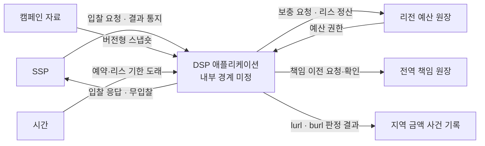
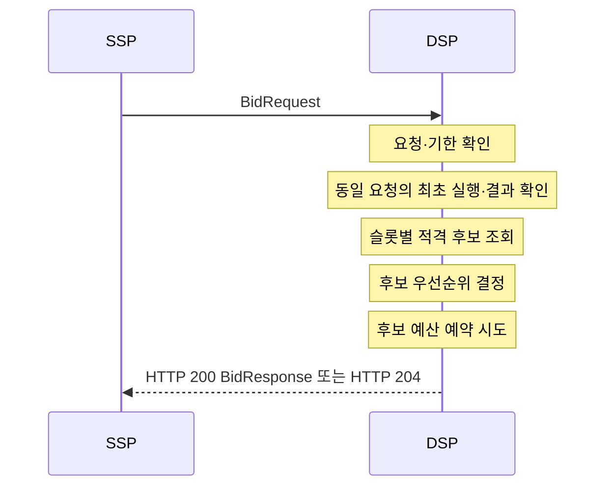
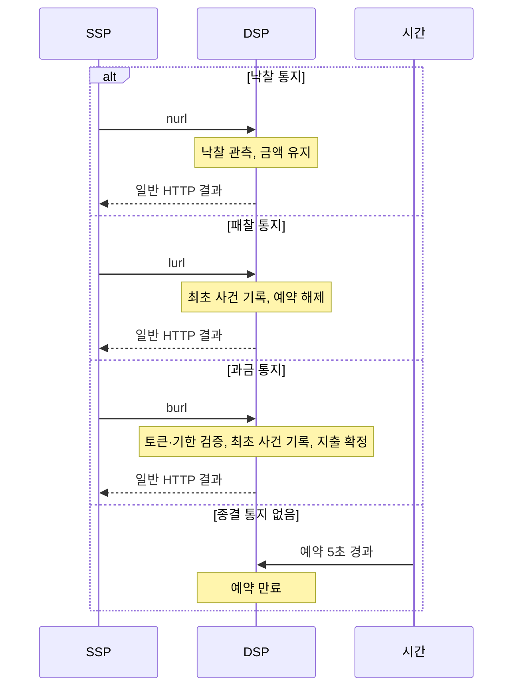

# DSP 협력과 메시지

상태: 초안

범위는 [DSP 컨테이너](dsp-containers.md)의 `DSP 애플리케이션`이다. 이 단계에서는 DSP 내부 컴포넌트를 정하지 않는다. 시스템이 참여하는 협력 장면을 나누고, 경계를 오가는 메시지와 그 결과만 확인한다.

## 전체 협력

DSP가 참여하는 협력은 여섯 장면으로 나뉜다.

1. 캠페인 준비: 확정된 캠페인 버전을 검증해 로컬 실행 자료로 바꾼다.
2. 입찰: SSP 요청에 대해 캠페인과 예산을 판단하고 응답한다.
3. 결과 통지: SSP가 경매·렌더링 결과를 알리면 예약을 종결한다.
4. 예산 권한: 리전 원장에서 입찰에 사용할 한정된 권한을 받아온다.
5. 정산: 끝난 권한의 확정 소비와 반환액을 리전 원장에 반영한다.
6. 리전 책임 이전: 부족한 리전 책임액을 전역 예비액에서 안전하게 이전한다.



여기서 DSP는 아직 하나의 상자다. 아래의 내부 메시지에도 수신 컴포넌트를 붙이지 않는다.

## 1. 캠페인 준비 협력

### 시작과 끝

- 시작: DSP 인스턴스가 시작하면서 실행할 캠페인 버전을 요구한다.
- 성공: 버전과 체크섬을 검증하고 슬롯 규격별 불변 조회 자료를 한 번에 공개한다.
- 실패: 이전에 검증한 자료가 없으면 입찰 준비 상태가 되지 않는다.

### 메시지 분해

```text
CampaignSnapshotRequested
  → CampaignVersionLoaded
    → CampaignSnapshotVerified | CampaignSnapshotRejected
      → 불변 실행 자료 공개
```

시험 중 캠페인 값은 바뀌지 않는다. 시작 후 요청마다 캠페인 저장소를 읽지 않으며, 적재 중인 일부 자료가 입찰 경로에 보이지 않게 한다.

## 2. 입찰 협력

### 시작과 끝

- 시작: SSP가 제한 시간이 있는 `BidRequest`를 보낸다.
- 성공: DSP가 슬롯별 `Bid`를 포함한 `BidResponse`를 반환한다.
- 정상 거절: 안전하게 입찰할 수 없는 슬롯은 입찰하지 않는다. 전체 무입찰은 사유를 알릴 때 HTTP 200 `BidResponse.nbr`, 사유가 없을 때 HTTP 204로 반환한다.

### 메시지 분해



| 순서 | 내부에서 필요한 메시지 | 묻는 내용 | 결과 |
|---:|---|---|---|
| 1 | `입찰 요청 확인` | 처리할 수 있는 형식이며 아직 기한 안인가? | 유효 요청 또는 거절 |
| 2 | `동일 입찰 실행` | 인증된 SSP와 요청 ID·지문이 같은 최초 실행 또는 재호출인가? | 최초 실행, 기존 결과 또는 충돌 |
| 3 | `적격 후보 조회` | 슬롯 규격·캠페인 상태·기간을 만족하는 후보는 무엇인가? | 후보 목록 |
| 4 | `후보 우선순위 결정` | 페이싱 목표에서 가장 뒤처진 후보는 무엇인가? | 정렬된 후보 |
| 5 | `예산 예약 시도` | 이 후보의 노출 금액을 현재 로컬 권한에서 안전하게 예약할 수 있는가? | 예약 성공 또는 거절 |
| 6 | `입찰 응답 생성` | 예약된 캠페인을 어떤 OpenRTB 응답으로 표현할 것인가? | 슬롯별 입찰과 통지 URL |

같은 SSP 요청은 최초 캠페인·소재·가격·`bidId`와 예약을 재사용한다. 기존 결과의 소유권이 불확실하면 새 예약을 만들지 않는다. 반환한 각 입찰에는 정확히 하나의 유효한 예약이 있어야 한다. 페이싱 지연이 큰 캠페인부터 예약하고, 동시 요청과 경합해 예약하지 못하면 같은 절대 기한 안에서 다음 캠페인을 시도한다. 한 슬롯의 실패는 다른 슬롯의 성공을 취소하지 않는다.

## 3. 결과 통지 협력

### 시작과 끝

- 시작: SSP가 DSP가 응답에 넣은 `nurl`, `lurl`, `burl` 중 하나를 호출한다.
- 끝: DSP가 통지의 의미를 한 번만 반영하고 일반 HTTP 결과를 반환한다.
- 보완 경로: 종결 통지가 없으면 예약 후 5초에 시간 경계가 예약을 끝낸다.

### 메시지 분해



| 외부 메시지 | 내부에서 필요한 메시지 | 금액 결과 |
|---|---|---|
| `nurl` | `낙찰 관측` | 예약 유지 |
| `lurl` | `통지 검증` → `사건 기록` → `예약 해제` | 잠재 지출 해제 |
| `burl` | `통지 검증` → `사건 기록` → `지출 확정` | 잠재 지출을 확정 지출로 변경 |
| 시간 경과 | `예약 만료` | 잠재 지출 해제 |

같은 통지가 반복되어도 금액 효과는 한 번이어야 한다. 모순되는 종결 통지가 도착하면 먼저 끝난 결과를 뒤집지 않고 충돌 사실을 격리한다. `lurl`과 `burl`은 내구 기록이 끝나기 전에 성공을 응답하지 않는다.

## 4. 예산 권한 협력

### 시작과 끝

- 시작: DSP가 시작하거나 캠페인의 로컬 권한이 보충 기준에 도달한다.
- 성공: 리전 예산 원장이 겹치지 않는 캠페인별 리스를 발급한다.
- 실패: DSP는 남은 권한만 사용하며, 소진된 캠페인은 원장을 기다리지 않고 입찰에서 제외한다.

### 메시지 분해

```text
권한 필요 감지
  → LeaseRequested
    → LeaseGranted | LeaseRejected
      → 로컬 사용 가능 권한 교체
```

| 메시지 | 의미 |
|---|---|
| `LeaseRequested` | 캠페인·DSP 인스턴스·필요액을 식별해 새 권한을 요청한다. |
| `LeaseGranted` | 리전 원장이 자기 책임액에서 격리한 소액·단기 권한을 넘긴다. |
| `LeaseRejected` | 권한 부족이나 원장 장애로 새 권한을 주지 못한다. 기존 리스에는 영향이 없다. |

이 협력은 입찰 요청과 독립적으로 진행한다. 입찰은 리스 응답을 기다리지 않는다.

## 5. 정산 협력

### 시작과 끝

- 시작: 한 리스에 속한 모든 예약의 통지 가능 기한이 끝난다.
- 성공: 리전 원장이 해당 리스의 확정 소비와 반환액을 한 번 반영한다.
- 실패: 같은 정산을 다시 시도하며, 완료 전 금액은 다른 권한으로 재발급하지 않는다.

### 메시지 분해

```text
리스 종결 가능
  → 금액 사건 집계
    → LeaseSettlementRequested
      → SettlementApplied | AlreadyApplied | SettlementRejected
```

| 메시지 | 의미 |
|---|---|
| `금액 사건 집계` | 리스의 액면을 확정 소비·미사용 반환·불확실한 격리액으로 나눈다. |
| `LeaseSettlementRequested` | 리스 식별자와 정산 세대로 결과를 원장에 제출한다. |
| `SettlementApplied` | 원장이 소비와 반환을 처음 반영했다. |
| `AlreadyApplied` | 같은 정산이 이미 반영되어 추가 금액 변화가 없다. |
| `SettlementRejected` | 현재는 안전하게 반영할 수 없어 정산 책임을 유지하고 재시도한다. |

`burl` 한 건마다 리전 예산 원장을 갱신하지 않는다. 금액 사건을 모아 리스 단위로 정산한다.

## 6. 리전 책임 이전 협력

### 시작과 끝

- 시작: 리전 책임액이 부족해져 새 DSP 리스를 충분히 발급할 수 없다.
- 성공: 전역 원장이 예비액을 먼저 격리하고 대상 리전이 같은 이전을 한 번 활성화한다.
- 실패: 불확실한 금액을 어느 쪽도 사용하지 않으며 각 리전은 기존 책임액으로 계속 처리한다.

### 메시지 분해

```text
RegionalResponsibilityRequested
  → TransferPrepared | TransferRejected
    → RegionalTransferActivated
      → TransferCompleted
```

| 메시지 | 의미 |
|---|---|
| `RegionalResponsibilityRequested` | 리전이 고유한 이전 식별자로 추가 책임액을 요청한다. |
| `TransferPrepared` | 전역 원장이 예비액을 차감하고 이전액을 사용 불가능하게 격리했다. |
| `RegionalTransferActivated` | 대상 리전이 같은 이전 식별자의 책임액을 한 번 활성화했다. |
| `TransferCompleted` | 전역 원장이 활성화 증거를 확인하고 이전 중 상태를 끝냈다. |
| `TransferRejected` | 예비액 부족이나 불확실한 연결 때문에 새 이전을 만들지 않는다. |

리전끼리 직접 금액을 넘기지 않는다. 이 협력은 입찰·리스 발급과 독립적으로 재시도하며, 중간 상태의 금액은 입찰 권한으로 사용하지 않는다.

## 아직 하지 않는 결정

이 문서는 다음을 정하지 않는다.

- DSP 내부 컴포넌트의 수와 이름
- 어느 객체가 각 메시지를 처리하는지
- 같은 프로세스 안의 직접 호출인지 비동기 전달인지
- Java 인터페이스·패키지·자료구조
- 저장소 제품과 실행 자원 분리

다음 단계에서 메시지를 함께 처리해야 불변식을 지킬 수 있는 것과 서로 독립적으로 변하는 것을 구분한 뒤 책임을 묶는다. 그 결과가 컴포넌트 후보가 된다.
