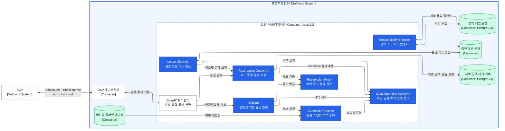

# DSP 애플리케이션 컴포넌트

상태: 현재 불변식 기준 최상위 경계 재확정 · 패키지 경계 적용 완료

범위는 [DSP 컨테이너](dsp-containers.md)의 `DSP 애플리케이션` 하나다. 컴포넌트는 처리 순서나 저장소 수가 아니라, 현재 시스템에서 하나의 불변식 군을 증명하는 데 함께 필요한 상태와 연산으로 나눈다. 도출 근거는 [DSP 협력과 메시지](dsp-collaboration.md)에 있다.

최상위 체계는 여섯 핵심·제어 컴포넌트와 하나의 지원 컴포넌트다. OpenRTB와 저장소 접근은 이 컴포넌트들을 외부 계약에 연결하는 어댑터이며 별도 업무 권위를 소유하지 않는다.

## C4 Level 3

화살표는 의존 관계다. 호출 순서나 독립 스레드·프로세스를 뜻하지 않는다.

## 책임 경계

| 컴포넌트 | 함께 묶은 이유 | 소유하는 불변식·정책 | 소유하지 않는 것 |
|---|---|---|---|
| Campaign Runtime | 완결된 캠페인 버전과 그 조회 구조를 함께 공개해야 한다. | 한 조회에서 한 버전, 캠페인·소재 적격성, 결정적인 후보 순위 | 원자적 예산 승인 |
| Bidding | 요청 실행권·절대 기한·슬롯 진행이 하나의 요청 수명을 공유한다. | 같은 요청 실행 최대 한 번, 기한 이후 무입찰, 슬롯별 최대 한 입찰과 부분 성공 | 후보 내부 규칙·금액 상태 |
| Local Spending Authority | 같은 캠페인의 리스·금액·예약 전이를 한 원자 경계에서 처리해야 한다. | 다중 로컬 리스의 액면 보존, 예약의 한 번뿐인 종결 | 통지 진위·내구 결과 결정 |
| Reservation Outcome | 종결 후보의 최초 결정과 그 결정의 재생이 하나의 내구 계약이다. | 예약별 canonical `LOSS`·`BILLING`·`EXPIRY` 하나, 결정 후 로컬 재생 | 예약 생성·리스 총량 |
| Lease Lifecycle | 위임 권한의 유입과 반환이 같은 리스 액면을 보존해야 한다. | 확인된 리스만 설치, 안전 회복 시점 이후 소비·반환·격리 합계, 멱등 정산 | 전역 책임 배분 |
| Responsibility Transfer | 전역과 리전 사이의 준비·활성화·완료 순서가 하나의 이전 프로토콜이다. | 이전 중 격리, 지역 활성화, `transferId` 멱등성 | DSP 로컬 예약·리스 발급 |
| Reservation Proof | 발급자와 검증자가 같은 예약 신원·무결성 계약을 사용해야 한다. | 예약·리스·금액·SSP·리전·기한의 인증된 증표 발급·검증 | 예약·결과 상태 변경 |

## 핵심 메시지와 인터페이스

내부 메시지는 같은 프로세스의 불변 값이다. 메시지 브로커나 원격 RPC 계약을 뜻하지 않는다.

| 제공 컴포넌트 | 인터페이스 | 입력 → 출력 |
|---|---|---|
| OpenRTB 어댑터 | `DspOpenRtbApi` | 외부 OpenRTB 메시지 ↔ 내부 입찰·통지 메시지 |
| Bidding | `BidCoordinator` | 인증된 입찰 요청 → 슬롯별 `BidDecision` 또는 빠른 거절 |
| Campaign Runtime | `CampaignCandidateSource` | 슬롯 조건 → 순서가 있는 `CampaignCandidate` |
| Local Spending Authority | 예약 포트·종결 포트·리스 설치 포트·투영 포트 | 예약·종결·설치 명령 → 상태 변경 결과 |
| Reservation Proof | `ReservationNoticeIssuer`, `ReservationNoticeVerifier` | 예약 사실 → 증표 URL, 불투명 토큰 → 검증된 예약 사실 |
| Reservation Outcome | `ReservationOutcomeProcessor`, `LeaseOutcomeView` | 종결 후보 → canonical 결과, `leaseId` → 정산 요약 |
| Lease Lifecycle | `LeaseRefill`, `LeaseSettlement` | 보충·정산 명령 → 각 처리 결과 |
| Responsibility Transfer | `ResponsibilityTransfer` | 책임 이전 요청 → 완료·재사용·거절 |

## 협력 계약

### 입찰

1. OpenRTB 어댑터는 인증된 SSP ID와 요청 ID를 내부 요청으로 바꾸고 `tmax`를 단조 시계 기반 절대 기한으로 바꾼다.
2. Bidding의 내부 실행권은 같은 키의 최초 호출 하나만 실행하고 후속 요청은 기다리지 않고 거절한다.
3. Bidding은 슬롯마다 Campaign Runtime에 순서 있는 후보를 요구한다.
4. 페이싱 지연이 큰 후보부터 로컬 예산 권한에 예약을 시도한다.
5. 경합으로 예약이 실패하면 같은 절대 기한 안에서 다음 후보를 시도한다.
6. 예약에 성공한 슬롯만 예약 통지 증표를 발급해 응답한다.
7. 한 슬롯의 실패는 다른 슬롯의 예약을 되돌리지 않는다.

### 결과 통지

1. OpenRTB 계약은 URL 종류와 불투명 토큰을 내부 통지로 바꾼다.
2. 예약 통지 증표는 신원·금액·리스·기한과 무결성을 검증한다.
3. `nurl`은 관측만 남기고 금액을 바꾸지 않는다.
4. `lurl`·`burl`·만료는 Reservation Outcome에서 하나의 canonical 결과를 내구 결정한다.
5. canonical 결과를 Local Spending Authority에 해제·확정·만료 명령으로 재생한다.
6. 같은 종결 메시지는 같은 결과를 내며 모순된 메시지는 기존 금액 상태를 뒤집지 않는다.

### 권한과 정산

1. 리스 생명주기는 입찰 경로 밖에서 리전 예산 원장에 권한을 요청한다.
2. 발급이 복구 가능하게 확인된 리스만 로컬 예산 권한에 설치한다.
3. 각 예약에 봉인된 기한과 원장이 정한 안전 회복 시점이 지난 리스만 금액 사건으로 소비·반환·격리액을 계산한다.
4. 같은 `leaseId`와 정산 세대를 리전 예산 원장에 여러 번 보내도 한 번만 반영한다.
5. 리전 책임이 부족하면 리전 책임 제어가 전역 원장에 이전을 요청하며 입찰은 이를 기다리지 않는다.

리스의 절대 시각과 안전 회복 시점은 원장이 소유한다. DSP는 보충 요청 직전의 단조 시각에 원장이 발급한 기간을 더해 로컬 사용 기한을 만들므로 벽시계 오차로 권한이 연장되지 않는다. 정산 작업자가 중단되면 원장 작업 임대 만료 뒤 다른 작업자가 더 높은 세대로 이어받는다.

## 구현 경계

- 여섯 핵심·제어 컴포넌트와 Reservation Proof는 하나의 DSP 애플리케이션 프로세스에 둔다.
- DSP 게이트웨이는 `sspId + BidRequest.id`의 안정된 소유 인스턴스로 요청을 보내 로컬 중복 상태를 유효하게 만든다. 소유권이 불확실한 장애 전환에서는 같은 요청을 새로 실행하지 않는다.
- 캠페인 적재기는 캠페인 선택 뒤의 제어 경로 어댑터다. 검증된 완결 스냅숏만 한 번에 공개하며 시험 중 변경하지 않는다.
- PostgreSQL 접근, 리전 예산 원장과 전역 책임 원장 접근은 각 책임 뒤의 저장소 포트다. 저장소 포트를 별도 업무 컴포넌트로 세지 않는다.
- 입찰 조정·캠페인 선택·로컬 예약은 동기 로컬 호출이다. 로컬 예약은 캠페인별 `tryLock()` 획득 실패를 경합 거절로 반환하고 다음 후보를 기다리게 하지 않는다. 외부 저장소 I/O가 필요한 통지 기록·리스·책임 이전만 비동기 완료를 표현한다.
- 각 업무 컴포넌트는 하나의 Gradle 모듈 안에서도 `api`(제공 계약), `spi`(필요 계약), `internal`(구현)로 나눈다. 다른 컴포넌트는 `api`만 의존할 수 있으며 이 규칙은 ArchUnit으로 검증한다.
- 인터페이스는 책임과 메시지 의미만 고정한다. HTTP 서버, JSON 라이브러리, 암호 구현, 원장 제품과 실행 자원 수는 조립 계층에서 선택한다.

## 코드 위치

| 책임 | 제공 계약 (`api`) | 필요 계약 (`spi`) | 은닉 구현 (`internal`) |
|---|---|---|---|
| OpenRTB 어댑터 | `com.bbororo.rtb.dsp.openrtb` | — | — |
| Bidding | `com.bbororo.rtb.dsp.bidding.api` | — | `com.bbororo.rtb.dsp.bidding.internal` |
| Campaign Runtime | `com.bbororo.rtb.dsp.campaignruntime.api` | `com.bbororo.rtb.dsp.campaignruntime.spi` | `com.bbororo.rtb.dsp.campaignruntime.internal` |
| Local Spending Authority | `com.bbororo.rtb.dsp.spending.api` | — | `com.bbororo.rtb.dsp.spending.internal` |
| Reservation Proof | `com.bbororo.rtb.dsp.proof.api` | `com.bbororo.rtb.dsp.proof.spi` | `com.bbororo.rtb.dsp.proof.internal` |
| Reservation Outcome | `com.bbororo.rtb.dsp.outcome.api` | `com.bbororo.rtb.dsp.outcome.spi` | `com.bbororo.rtb.dsp.outcome.internal` |
| Lease Lifecycle | `com.bbororo.rtb.dsp.lease.api` | `com.bbororo.rtb.dsp.lease.spi` | `com.bbororo.rtb.dsp.lease.internal` |
| Responsibility Transfer | `com.bbororo.rtb.dsp.responsibility.api` | `com.bbororo.rtb.dsp.responsibility.spi` | `com.bbororo.rtb.dsp.responsibility.internal` |

`spi`는 해당 컴포넌트가 외부 저장소·키·스냅숏 공급자에게 요구하는 계약이다. 현재 어댑터 구현은 소유 컴포넌트의 `internal`에 두므로 다른 업무 컴포넌트가 `spi`를 직접 조립하거나 호출하지 않는다. SSP 코드를 공유하거나 참조하지 않고 양쪽이 각자 OpenRTB 표현을 소유한다.
