# DSP 애플리케이션 컴포넌트

상태: C3 책임·협력 경계 확정 · Java 메시지·인터페이스 기준선 적용

범위는 [DSP 컨테이너](dsp-containers.md)의 `DSP 애플리케이션` 하나다. 컴포넌트는 처리 순서가 아니라 같은 불변식을 보호하는 상태 소유권과 서로 다른 변경 이유로 나눴다. 도출 근거는 [DSP 협력과 메시지](dsp-collaboration.md)에 있다.

## C4 Level 3

```mermaid
%%{init: {"flowchart": {"defaultRenderer": "elk"}}}%%
flowchart LR
    SSP["SSP<br/>[Software System]"]

    subgraph DSP["프로젝트 DSP [Software System]"]
        direction TB
        GATEWAY["DSP 게이트웨이<br/>[Container]"]

        subgraph APP["DSP 애플리케이션 [Container: Java 21]"]
            direction TB
            API["OpenRTB 계약<br/>요청·응답·통지 표현"]
            DEDUPE["입찰 중복 방지<br/>최초 실행·결과 재사용"]
            AUCTION["입찰 조정<br/>기한·슬롯별 부분 성공"]
            CAMPAIGN["캠페인 선택<br/>적격성·페이싱 순위"]
            BUDGET["로컬 예산 권한<br/>예약·해제·확정·만료"]
            TOKEN["예약 통지 증표<br/>URL 발급·검증"]
            NOTICE["경매 결과 처리<br/>nurl·lurl·burl 멱등 반영"]
            LEASE["리스 생명주기<br/>보충·종결·정산"]
            TRANSFER["리전 책임 제어<br/>부족 감지·책임 이전"]

            API -->|"인증된 입찰 요청"| DEDUPE
            DEDUPE -->|"최초 입찰 명령"| AUCTION
            AUCTION -->|"후보 요청"| CAMPAIGN
            CAMPAIGN -->|"페이싱 조회"| BUDGET
            AUCTION -->|"예약 시도"| BUDGET
            AUCTION -->|"통지 URL 발급"| TOKEN
            API -->|"결과 통지"| NOTICE
            NOTICE -->|"증표 검증"| TOKEN
            NOTICE -->|"예약 종결"| BUDGET
            LEASE <-->|"권한 설치·종결"| BUDGET
            TRANSFER -->|"리전 책임 보충"| LEASE
        end

        CAMPAIGN_STORE[("버전형 캠페인 데이터<br/>[Container]")]
        REGIONAL[("리전 예산 원장<br/>[Container]")]
        MONEY[("지역 금액 사건 기록<br/>[Container: PostgreSQL]")]
        GLOBAL[("전역 책임 원장<br/>[Container: PostgreSQL]")]
    end

    SSP <-->|"BidRequest · BidResponse<br/>nurl · lurl · burl"| GATEWAY
    GATEWAY <-->|"입찰·통지 전달"| API
    CAMPAIGN_STORE -->|"버전·체크섬"| CAMPAIGN
    NOTICE -->|"최초·중복·충돌 사건"| MONEY
    LEASE -->|"리스 사건 집계"| MONEY
    LEASE <-->|"발급·멱등 정산"| REGIONAL
    TRANSFER <-->|"지역 활성화"| REGIONAL
    TRANSFER <-->|"격리·완료"| GLOBAL

    classDef component fill:#2563eb,color:#fff,stroke:#1d4ed8,stroke-width:1.5px;
    classDef external fill:#fff,color:#172033,stroke:#94a3b8,stroke-width:1.5px;
    classDef store fill:#d1fae5,color:#064e3b,stroke:#10b981,stroke-width:1.5px;
    class API,DEDUPE,AUCTION,CAMPAIGN,BUDGET,TOKEN,NOTICE,LEASE,TRANSFER component;
    class SSP,GATEWAY external;
    class CAMPAIGN_STORE,REGIONAL,MONEY,GLOBAL store;
    style DSP fill:#eff6ff,stroke:#2563eb,stroke-width:2px
    style APP fill:#ffffff,stroke:#3b82f6,stroke-width:1.5px,stroke-dasharray:6 4
```

화살표는 의존 관계다. 호출 순서나 독립 스레드·프로세스를 뜻하지 않는다.

## 책임 경계

| 컴포넌트 | 함께 묶은 이유 | 소유하는 불변식·정책 | 소유하지 않는 것 |
|---|---|---|---|
| OpenRTB 계약 | 외부 규격이 바뀔 때 함께 변한다. | OpenRTB 하위 규격 검증과 내부 메시지 변환 | 캠페인·금액 판단 |
| 입찰 중복 방지 | 최초 실행과 결과 재사용이 같은 요청 상태를 공유한다. | SSP·요청 키와 지문, 동시 최초 실행 하나, 완성 결과 재사용 | 캠페인·예산 정책 |
| 입찰 조정 | 요청 기한과 슬롯별 협력 순서가 함께 변한다. | 절대 기한, 슬롯별 최대 한 입찰, 슬롯별 부분 성공 | 후보 순위·금액 상태 |
| 캠페인 선택 | 캠페인 규칙과 조회 구조가 함께 변한다. | 활성·기간·규격 적격성, 페이싱 지연·`campaignId` 순위 | 예산 예약 성공 여부 |
| 로컬 예산 권한 | 같은 캠페인의 금액·리스·예약 전이는 한 원자 경계에서 처리해야 한다. | 다중 로컬 리스의 액면 보존, 예약의 한 번뿐인 종결 | 통지 진위·내구 기록 |
| 예약 통지 증표 | 외부에 공개하는 예약 신원과 무결성 규칙이 함께 변한다. | 예약·리스·금액·발급 리전·기한의 인증된 URL 발급·검증 | 예약 상태 변경 |
| 경매 결과 처리 | 통지 멱등성과 내구 기록 순서가 함께 변한다. | `nurl` 관측, `lurl`·`burl` 최초·중복·충돌 판정, 기록 후 종결 | 리스 총량·정산 |
| 리스 생명주기 | 로컬 권한의 공급과 반환이 같은 리스 상태를 공유한다. | 비동기 보충, 끝난 리스의 소비·반환·격리 합계, 멱등 정산 | 전역 책임 배분 |
| 리전 책임 제어 | 전역과 리전 사이의 책임 이전 불변식이 별도다. | 이전 중 격리, 지역 활성화, 이전 ID 멱등성 | DSP 로컬 예약 |

## 핵심 메시지와 인터페이스

내부 메시지는 같은 프로세스의 불변 값이다. 메시지 브로커나 원격 RPC 계약을 뜻하지 않는다.

| 제공 컴포넌트 | 인터페이스 | 입력 → 출력 |
|---|---|---|
| OpenRTB 계약 | `DspOpenRtbApi` | `BidRequest` → `BidResponse` 또는 `NoBid`, `AuctionNotice` → 일반 HTTP 판정 |
| 입찰 중복 방지 | `BidDeduplicator` | `ExecuteBidOnce` → 최초 실행 또는 동일 `BidDecision` |
| 입찰 조정 | `BidCoordinator` | `CoordinateBid` → 슬롯별 `BidDecision` |
| 캠페인 선택 | `CampaignSelector` | `RankCampaigns` → 순서가 있는 `CampaignCandidate` |
| 로컬 예산 권한 | `LocalBudgetAuthority` | `TryReserve`, `ReleaseReservation`, `CommitReservation`, `ExpireReservation`, `InstallLease` → 상태 변경 결과 |
| 예약 통지 증표 | `ReservationNoticeIssuer`, `ReservationNoticeVerifier` | `IssueReservationNotices` → `ReservationNoticeUrls`, 불투명 토큰 → `VerifiedReservationNotice` |
| 경매 결과 처리 | `AuctionNoticeProcessor` | `AuctionNotice` → 검증·기록·종결한 `NoticeProcessingResult` |
| 리스 생명주기 | `LeaseLifecycle` | `RefillLease`, 원장이 임대한 `SettlementWork` → 리스 처리 결과 |
| 리전 책임 제어 | `RegionalResponsibilityController` | `RequestRegionalResponsibility` → 이전 처리 결과 |

## 협력 계약

### 입찰

1. OpenRTB 계약은 인증된 SSP ID와 요청 ID로 중복 키를 만들고 `tmax`를 단조 시계 기반 절대 기한으로 바꾼다.
2. 입찰 중복 방지는 같은 키·지문의 동시 최초 실행을 하나로 합치고 완성된 결과를 재사용한다.
3. 입찰 조정은 슬롯마다 캠페인 선택에 순서 있는 후보를 요구한다.
4. 페이싱 지연이 큰 후보부터 로컬 예산 권한에 예약을 시도한다.
5. 경합으로 예약이 실패하면 같은 절대 기한 안에서 다음 후보를 시도한다.
6. 예약에 성공한 슬롯만 예약 통지 증표를 발급해 응답한다.
7. 한 슬롯의 실패는 다른 슬롯의 예약을 되돌리지 않는다.

### 결과 통지

1. OpenRTB 계약은 URL 종류와 불투명 토큰을 내부 통지로 바꾼다.
2. 예약 통지 증표는 신원·금액·리스·기한과 무결성을 검증한다.
3. `nurl`은 관측만 남기고 금액을 바꾸지 않는다.
4. `lurl`·`burl`은 지역 금액 사건 기록에서 최초·중복·충돌을 판정한다.
5. 최초 사건을 복구 가능하게 기록한 뒤 로컬 예산 권한에 해제 또는 확정을 명령한다.
6. 같은 종결 메시지는 같은 결과를 내며 모순된 메시지는 기존 금액 상태를 뒤집지 않는다.

### 권한과 정산

1. 리스 생명주기는 입찰 경로 밖에서 리전 예산 원장에 권한을 요청한다.
2. 발급이 복구 가능하게 확인된 리스만 로컬 예산 권한에 설치한다.
3. 모든 예약의 5초 기한이 끝난 리스만 금액 사건으로 소비·반환·격리액을 계산한다.
4. 같은 `leaseId`와 정산 세대를 리전 예산 원장에 여러 번 보내도 한 번만 반영한다.
5. 리전 책임이 부족하면 리전 책임 제어가 전역 원장에 이전을 요청하며 입찰은 이를 기다리지 않는다.

리스의 절대 시각과 안전 회복 시점은 원장이 소유한다. DSP는 보충 요청 직전의 단조 시각에 원장이 발급한 기간을 더해 로컬 사용 기한을 만들므로 벽시계 오차로 권한이 연장되지 않는다. 정산 작업자가 중단되면 원장 작업 임대 만료 뒤 다른 작업자가 더 높은 세대로 이어받는다.

## 구현 경계

- 아홉 컴포넌트는 우선 하나의 DSP 애플리케이션 프로세스에 둔다.
- DSP 게이트웨이는 `sspId + BidRequest.id`의 안정된 소유 인스턴스로 요청을 보내 로컬 중복 상태를 유효하게 만든다. 소유권이 불확실한 장애 전환에서는 같은 요청을 새로 실행하지 않는다.
- 캠페인 적재기는 캠페인 선택 뒤의 제어 경로 어댑터다. 검증된 완결 스냅숏만 한 번에 공개하며 시험 중 변경하지 않는다.
- PostgreSQL 접근, 리전 예산 원장과 전역 책임 원장 접근은 각 책임 뒤의 저장소 포트다. 저장소 포트를 별도 업무 컴포넌트로 세지 않는다.
- 입찰 조정·캠페인 선택·로컬 예약은 동기 로컬 호출이다. 로컬 예약은 캠페인별 `tryLock()` 획득 실패를 경합 거절로 반환하고 다음 후보를 기다리게 하지 않는다. 외부 저장소 I/O가 필요한 통지 기록·리스·책임 이전만 비동기 완료를 표현한다.
- 인터페이스는 책임과 메시지 의미만 고정한다. HTTP 서버, JSON 라이브러리, 암호 구현, 원장 제품과 실행 자원 수는 후속 구현에서 정한다.

## 코드 위치

| 책임 | 메시지·인터페이스 패키지 |
|---|---|
| OpenRTB 계약 | `com.bbororo.rtb.dsp.openrtb` |
| 입찰 중복 방지·입찰 조정 | `com.bbororo.rtb.dsp.auction` |
| 캠페인 적재·선택 | `com.bbororo.rtb.dsp.campaign` |
| 로컬 예산·페이싱 투영 | `com.bbororo.rtb.dsp.budget` |
| 예약 통지 증표·경매 결과 처리 | `com.bbororo.rtb.dsp.notification` |
| 리스 보충·정산 | `com.bbororo.rtb.dsp.lease` |
| 전역·리전 책임 이전 | `com.bbororo.rtb.dsp.allocation` |

각 패키지의 `*Messages`는 불변 값, 컴포넌트 이름의 인터페이스는 제공 경계, `*Source`·`*Ledger`·`*Journal`은 외부 저장소 포트다. SSP 코드를 공유하거나 참조하지 않고 양쪽이 각자 OpenRTB 표현을 소유한다.
