# SSP 애플리케이션 컴포넌트

상태: C3 책임·협력·인터페이스 경계 확정 · 첫 구현 기준선 적용

범위는 [SSP 컨테이너](ssp-containers.md)의 `SSP 애플리케이션` 하나다. 이 문서의 8개 컴포넌트는 배포 단위나 Java 패키지 수가 아니라, 각자 바꿀 수 있는 규칙과 데이터 책임을 나타낸다.

## C4 Level 3

```mermaid
%%{init: {"flowchart": {"defaultRenderer": "elk"}}}%%
flowchart LR
    subgraph SUPPLY["공급 측"]
        direction TB
        SUPPLIER["공급자 시스템<br/>[Software System]"]
        CLIENT["광고 표시 클라이언트<br/>[Software System]"]
        SUPPLIER -->|"광고 응답·증표 전달"| CLIENT
    end

    subgraph SSP["SSP [Software System]"]
        direction TB
        subgraph APP["SSP 애플리케이션 [Container: Java 21]"]
            direction TB
            API["경매·렌더링 API<br/>HTTP 계약 검증·응답"]
            DEDUPE["경매 중복 방지<br/>최초 실행·결과 재사용"]
            COORDINATOR["경매 조정<br/>기한·병렬 호출·통지 조정"]
            BIDDER["DSP 입찰 실행<br/>DSP별 OpenRTB 통신"]
            WINNER["낙찰 결정<br/>입찰 검증·1가격 규칙"]
            PROOF["렌더링 증표<br/>발급·검증·기한"]
            CLAIM["렌더링 청구<br/>청구·전달 작업 원자 생성"]
            DELIVERY["DSP 통지 전달<br/>nurl·lurl·burl 전달·재시도"]

            API -->|"경매 요청"| DEDUPE
            DEDUPE -->|"최초 경매"| COORDINATOR
            COORDINATOR -->|"입찰 요청"| BIDDER
            COORDINATOR -->|"유효 입찰"| WINNER
            COORDINATOR -->|"낙찰 사실"| PROOF
            COORDINATOR -->|"nurl·lurl"| DELIVERY
            API -->|"렌더링 완료"| CLAIM
            CLAIM -->|"증표 검증"| PROOF
        end

        STORE[("리전별 SSP 청구 기록 DB<br/>[Container: PostgreSQL]")]
        CLAIM -->|"청구·전달 작업 원자 기록"| STORE
        DELIVERY -->|"작업 임대·결과 기록"| STORE
    end

    DSPS["DSP 회사들<br/>프로젝트 DSP · 외부 DSP<br/>[Software Systems]"]

    SUPPLIER -->|"경매 요청 / 응답"| API
    CLIENT -->|"렌더링 완료·증표"| API
    BIDDER -->|"입찰 요청·응답"| DSPS
    DELIVERY -->|"nurl·lurl·burl"| DSPS

    classDef component fill:#2563eb,color:#fff,stroke:#1d4ed8,stroke-width:1.5px;
    classDef external fill:#fff,color:#172033,stroke:#94a3b8,stroke-width:1.5px;
    classDef store fill:#d1fae5,color:#064e3b,stroke:#10b981,stroke-width:1.5px;
    class API,DEDUPE,COORDINATOR,BIDDER,WINNER,PROOF,CLAIM,DELIVERY component;
    class SUPPLIER,CLIENT,DSPS external;
    class STORE store;
    style SUPPLY fill:#f1f5f9,stroke:#94a3b8,stroke-width:1.5px
    style SSP fill:#eff6ff,stroke:#2563eb,stroke-width:2px
    style APP fill:#ffffff,stroke:#3b82f6,stroke-width:1.5px,stroke-dasharray:6 4
```

화살표는 의존 관계다. 경매가 실제로 진행되는 순서는 별도 구현·시험 흐름에서 검증하며, 이 그림은 그 순서를 강제하지 않는다.

## 책임과 협력

| 컴포넌트 | 소유 책임 | 협력 메시지 | 소유하지 않는 것 |
|---|---|---|---|
| 경매·렌더링 API | 프로젝트 공급자 HTTP 표현 검증, 지역 렌더링 URL로의 응답 | `AuctionRequest`, `RenderCompleted` | 경매·청구 규칙 |
| 경매 중복 방지 | 요청 키·지문, 최초 실행과 5초 최종 응답 재사용, 메모리 상한 | 최초 `StartAuction` 또는 동일 `AuctionResult` | DSP 호출·낙찰 규칙 |
| 경매 조정 | 요청별 `tmax` 절대 기한, DSP 실행·낙찰·`nurl`·`lurl` 연결 | `StartAuction` → `AuctionOutcome` | DSP별 통신 세부·가격 규칙 |
| DSP 입찰 실행 | DSP별 요청 변환·하위 기한·연결·동시 호출 격리와 응답 상한 | `BidRequestBatch` → `BidResponses` | 낙찰과 예산 판단 |
| 낙찰 결정 | 입찰 유효성, 1가격, 경매별 분산 동점 처리 | `auctionId` + `AuctionRequest` + `BidResponses` → `AuctionWinners` | 네트워크·시계·저장소 |
| 렌더링 증표 | 공급자·요청·슬롯·발급 리전 귀속을 가진 AEAD 증표 발급·검증, 2초 기한 | `ProofIssuance` → `RenderProof`, `RenderCompleted` → `VerifiedRender` | 청구 기록·`burl` 전달 |
| 렌더링 청구 | 유효 증표와 현재 공급자 활성 상태의 청구 판정, 슬롯별 멱등 청구와 전달 작업의 원자 생성 | `VerifiedRender` → `RenderAcceptance` | `burl` HTTP 호출·재시도 |
| DSP 통지 전달 | `nurl`·`lurl` 단발 통지, `burl` 작업 임대·전달·종결 | `AuctionNotice`, `BillingDeliveryTask` | DSP 내부 금액 판정 |

`BillingClaimRecorded`와 `BillingDeliveryPending`은 같은 DB 트랜잭션에서 생성한다. 이 커밋이 성공한 뒤에만 API가 렌더링 성공을 응답한다. 따라서 성공 응답은 “청구와 `burl` 전달 책임이 내구화됐다”는 뜻이다.

## 인터페이스

### 외부 HTTP 인터페이스

| 상대 | 요청 | 성공 응답 | 실패·중복 규칙 |
|---|---|---|---|
| 공급자 시스템 | 프로젝트 공급자 경매 요청 | 낙찰 결과·렌더링 증표 또는 no-bid | 지역 설정 스냅숏의 공급자 ID·키 ID·활성 상태를 검증한다. 같은 요청은 중복 방지가 최초 결과를 재사용한다. |
| 광고 표시 클라이언트 | 발급 리전 URL의 `RenderCompleted(renderProof)` | `204 No Content` | `204`는 청구·전달 작업 커밋 뒤에만 반환한다. 증표의 공급자 귀속과 현재 활성 상태를 함께 확인한다. 같은 증표는 다시 `204`, 다른 증표로 같은 키를 주장하면 거부한다. 저장 실패는 `5xx`로 재시도를 유도한다. |
| DSP 회사 | OpenRTB 입찰 요청 | DSP별 `200` 입찰 또는 `204` 무입찰 | 하위 기한 뒤 응답은 무시한다. 잘못된 형식·요청 귀속·크기 초과는 해당 DSP만 제외한다. |
| DSP 회사 | `nurl`·`lurl`·`burl` HTTP 호출 | 일반 HTTP 성공 | `nurl`·`lurl`은 단발 최선 노력이다. `burl`은 5초 상한 안에서만 재시도하며 HTTP 성공은 전달 성공일 뿐 과금 확정의 증거가 아니다. |

### 내부 협력 인터페이스

내부 메시지는 같은 프로세스 안의 명령·값 객체다. 별도 메시지 브로커나 원격 RPC 계약을 뜻하지 않는다.

| 제공 컴포넌트 | 인터페이스 | 입력 → 출력 | 규칙 |
|---|---|---|---|
| 경매 중복 방지 | `execute` | `AuctionRequest` → 최초 `StartAuction` 또는 동일 `AuctionResult` | `providerId + providerRequestId`와 요청 지문을 함께 판정한다. 최초 실행은 DSP 호출부터 통지·증표 발급까지 끝낸 최종 응답을 저장한다. 기본 10,000개 상한에서는 기존 키를 보존하고 새 키만 빠르게 실패한다. |
| 경매 조정 | `runAuction` | `StartAuction` → `AuctionOutcome` | 절대 마감 시각을 하위 호출에 전달하며 마감 뒤 결과를 만들지 않는다. |
| DSP 입찰 실행 | `requestBids` | `BidRequestBatch` → `BidResponses` | DSP마다 별도 HTTP 클라이언트와 동시 호출 허가를 사용한다. 허가가 없으면 대기하지 않고 해당 DSP만 탈락시킨다. |
| 낙찰 결정 | `selectWinners` | `auctionId` + `AuctionRequest` + `BidResponses` → `AuctionWinners` | 최저가 이상 최고 CPM을 제출가로 낙찰한다. 동가는 경매·슬롯·입찰 식별자의 결정적 해시로 분산하며 응답 순서에 영향받지 않는다. |
| 렌더링 증표 | `issue` / `verify` | `ProofIssuance` → `RenderProof`, `RenderCompleted` → `Optional<VerifiedRender>` | 공급자·요청·슬롯·낙찰 사실·발급 리전·1ms~2초 기한을 봉인한다. 같은 증표의 재검증은 같은 신원을 내며 금액 중복 판정은 렌더링 청구가 소유한다. |
| 렌더링 청구 | `acceptRender` | `VerifiedRender` → `RenderAcceptance` | 현재 지역 공급자 스냅숏에서 활성 상태를 확인하고, 청구와 `burl` 전달 작업을 함께 저장한 뒤에만 수락한다. |
| DSP 통지 전달 | `sendAuctionNotices` / `deliverDueBilling` | `AuctionNotice` / `BillingDeliveryTask` → 전달 결과 | `burl`은 중복될 수 있음을 전제로 한다. 제한된 작업자들이 세대번호가 붙은 작업을 임대하고, 일시 실패는 지수 지연해 재시도하며 5초 마감 뒤 미전달로 종결한다. |

### 저장소 포트

PostgreSQL 접근은 C3 컴포넌트가 아니라 구현 내부의 저장소 포트로 감춘다. 다음 세 연산이 SSP의 내구성 계약이다.

| 포트 | 호출자 | 보장 |
|---|---|---|
| `recordClaimAndScheduleDelivery` | 렌더링 청구 | `slotAuctionKey` 고유 제약 아래 최초 증표만 청구 사건과 전달 작업으로 저장한다. 같은 증표는 중복, 다른 증표는 충돌로 판정하며 저장 불확실성은 재시도 결과로 반환한다. |
| `leaseDueDelivery` | DSP 통지 전달 | 재시도 시각이 된 대기 작업 하나에 짧은 임대와 새 작업 세대번호를 원자 부여한다. 여러 작업자는 `SKIP LOCKED`로 서로 다른 작업을 가져간다. |
| `completeOrReleaseDelivery` | DSP 통지 전달 | 같은 작업 세대번호를 가진 실행기만 성공·재시도·미전달 결과를 기록한다. 재시도는 기한 안에서만 다음 실행 시각을 갖는다. |

작업 세대번호는 금액·인증 토큰이 아니다. 임대가 끝난 뒤 늦게 실행된 이전 작업자가 새 작업자의 결과를 덮어쓰지 못하게 하는 DB 조건값이다.

## 구현 경계

- 8개 컴포넌트는 우선 하나의 SSP 프로세스에 둔다. `burl` 전달 실행기는 각 인스턴스 내부의 백그라운드 실행기이며 별도 배포 서비스가 아니다.
- 경매 API와 렌더링 API도 우선 같은 진입 자원을 쓴다. 실제 경합이 경매 p99 50ms를 침범할 때만 실행 자원을 분리한다.
- 공급자 설정의 복제·메모리 스냅숏 교체는 경매 C3의 아홉 번째 업무 컴포넌트가 아닌 제어 경로 어댑터다. API는 그 스냅숏만 읽으며 서울의 설정 원본이나 도쿄 복제본을 요청마다 조회하지 않는다.
- 렌더링 증표는 공급자–SSP 프로젝트 전용 봉투이며 OpenRTB 객체에 넣지 않는다. SSP–DSP 경계만 OpenRTB 2.6의 `BidRequest`, `BidResponse`, `nurl`, `lurl`, `burl`, `Imp.exp`, `Bid.exp`를 사용한다.
- 외부 KRW CPM은 소수 셋째 자리까지 허용하고 내부에서는 0.001 KRW CPM을 1로 나타내는 `long` 고정소수점으로 바꾼다. 변환 과정에서 반올림하지 않는다.
- PostgreSQL 스키마, 연결 풀, `burl` 재시도 간격·동시 실행 수는 기준선 측정으로 정한다. 이는 위 책임·인터페이스 경계를 바꾸지 않는 운영 수치다.
